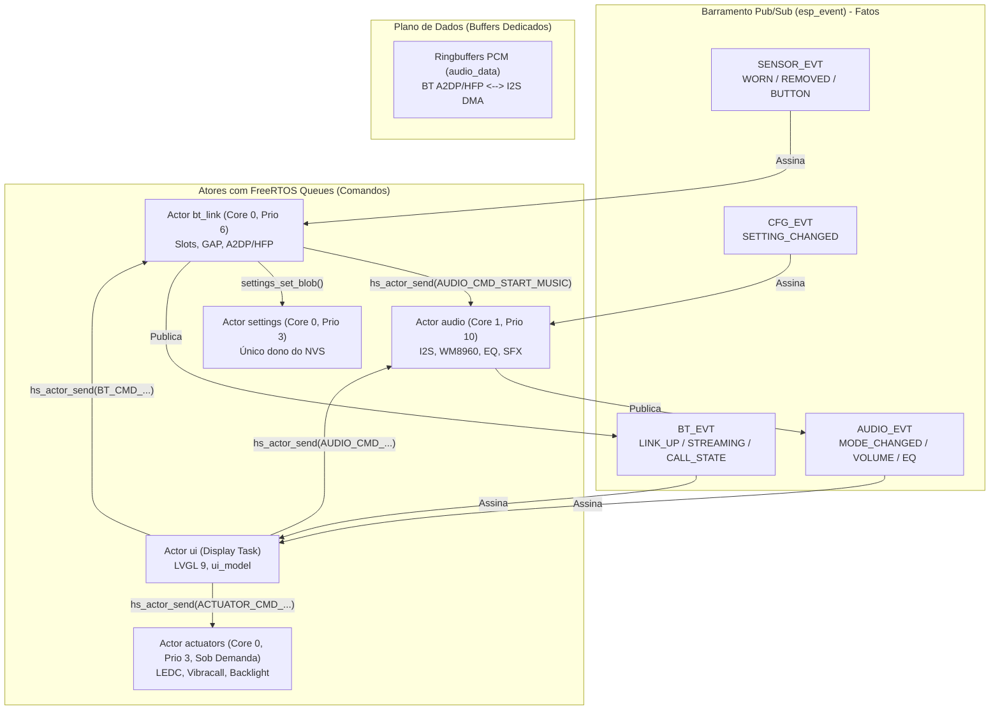

# Plano de Migração Arquitetural — Isolamento e Padronização dos Módulos

**Projeto:** `Headset4` (ESP32-WROVER-E · ESP-IDF v6.x · Bluedroid · LVGL 9.5)  
**Objetivo:** Isolar completamente os módulos do sistema eliminando acoplamentos diretos, chamadas síncronas cruzadas e concorrência descontrolada por mutexes. A comunicação entre subsistemas passa a ser estritamente controlada e padronizada através de:
1. **Fatos no passado (Notificações 1-para-N):** `esp_event` (`esp_event_post()` / `esp_event_handler_register()`).
2. **Ordens imperativas (Comandos 1-para-1):** FreeRTOS Queues com payloads nativos C via Motor de Atores (`hs_actor_send()` / `hs_actor_request()`).
3. **Fluxos contínuos de alto débito (Dados):** Ringbuffers de áudio PCM (`audio_data.h`) fora do barramento de eventos.

---

## 1. Princípios e Regras Invioláveis

- **Dois Planos Separados:**
  - *Plano de Controle:* Eventos e comandos estruturados em structs de tamanho fixo em C ($\le 64$ bytes em eventos; $\le 48$ bytes inline em comandos).
  - *Plano de Dados:* Fluxos PCM DMA de I2S e buffers de draw LVGL não passam pelo loop de eventos nem pelas filas de atores.
- **Evento ≠ Comando:**
  - *Evento (`esp_event`):* Notifica um fato ocorrido para múltiplos interessados (`BT_EVT_LINK_UP`, `SENSOR_EVT_WORN`, `CFG_EVT_SETTING_CHANGED`).
  - *Comando (Fila do Ator):* Representa uma instrução imperativa direcionada ao único dono do recurso (`AUDIO_CMD_START_MUSIC`, `BT_CMD_SELECT_SLOT`).
- **Um Recurso, Um Dono Único:**
  - Codec WM8960 + I2S DMA + EQ + Tons $\rightarrow$ Actor `audio`.
  - Pilha Bluetooth + Gestão de Slots + Pareamento $\rightarrow$ Actor `bt_link`.
  - Armazenamento NVS + Debounce de Escrita $\rightarrow$ Actor `settings`.
  - Interface Gráfica LVGL $\rightarrow$ Actor `ui`.
  - Periféricos PWM / Vibração $\rightarrow$ Actor `actuators` (sob demanda).
- **Handlers de Eventos Nunca Bloqueiam:** Proibido executar NVS, I2C, chamadas pesadas à pilha Bluetooth, delays ou esperar locks lentos dentro do callback do `esp_event`.
- **Padrão Strangler Fig:** Cada pacote mantém a integridade da compilação e o comportamento funcional do fone até a remoção completa do legado.

---

## 2. Mapa do Fluxo de Comunicação Padronizado

---

## 3. Passo a Passo de Execução

### Passo 1: Infraestrutura de Mensageria (Concluído)
- [x] Contrato de eventos `src/core/hs_events.h` com validação estática de payloads ($\le 64$ bytes).
- [x] Contrato de comandos `src/core/hs_cmds.h` parametrizado por domínios.
- [x] Motor genérico de Atores `src/core/hs_actor.h` e `src/core/hs_actor.c` com fila FreeRTOS, tasks sob demanda e métricas de descarte.
- [x] Actor de configurações `src/core/settings.c` com debounce e versionamento.

---

### Passo 2: Isolamento Total do NVS (Actor `settings`)
**Objetivo:** Eliminar qualquer chamada direta de `nvs_open`, `nvs_set_*` e `nvs_commit` fora de `settings.c`.
- **Tarefas:**
  1. No módulo de Fast Pair (`src/bt/bt_fastpair.c`), remover chamadas diretas a `nvs_open(NVS_NS, ...)` nas funções `keys_load()` e `keys_save_locked()`.
  2. Implementar chave específica em `settings` (ex: `SETTINGS_KEY_FASTPAIR_KEYS`) ou usar request/reply assíncrono para persistência de chaves de conta.
  3. Auditar a base: `grep -r "nvs_open" main/` deve apontar unicamente para `settings.c`.

---

### Passo 3: Actor de Áudio (Isolamento do Codec, I2S e SFX)
**Objetivo:** Encapsular hardware de áudio e desvincular a pilha Bluetooth de chamadas diretas de driver.
- **Tarefas:**
  1. Criar o Actor `audio` (`src/audio/audio.c` ou `audio_actor.c`) em Core 1, prioridade 10.
  2. Configurar o loop do ator para drenar sua FreeRTOS Queue processando:
     - `AUDIO_CMD_START_MUSIC`: Configura samplerate e inicializa DMA para reprodução A2DP.
     - `AUDIO_CMD_START_CALL`: Ativa áudio bidirecional e Voice NR para chamada telefônica.
     - `AUDIO_CMD_STOP`: Pausa/desativa I2S e coloca o codec em baixo consumo.
     - `AUDIO_CMD_SET_VOLUME`: Ajusta o WM8960.
     - `AUDIO_CMD_SET_EQ`: Aplica ganhos de equalizador.
     - `AUDIO_CMD_PLAY_TONE`: Toca efeitos sonoros (SFX).
  3. Remover `#include "sfx.h"` de `src/bt/bt_link_mgr.c`. O link manager publica `BT_EVT_LINK_UP` / `LINK_DOWN`, e o subsistema de áudio reage tocando o tom correspondente por assinatura do evento.
  4. Remover includes diretos de controle de áudio em `bt_a2dp.c`, `bt_hfp.c` e `bt_avrcp.c`. Eles enviam comandos ao ator de áudio ou publicam seus estados de streaming/chamada.
  5. Manter `audio_data.h` estritamente para os ringbuffers do plano de dados PCM.

---

### Passo 4: Actor de Bluetooth (`bt_link`)
**Objetivo:** Isolar o gerenciador de conexões em fila própria, eliminando o mutex recursivo e bloqueios no loop de eventos.
- **Tarefas:**
  1. Instanciar o Actor `bt_link` (Core 0, prioridade 6).
  2. Migrar o estado de slots, tentativas de conexão e timers para o contexto interno do ator.
  3. Substituir o mutex recursivo `s_mtx` por serialização na fila de comandos:
     - `BT_CMD_SELECT_SLOT`, `BT_CMD_DISCONNECT`, `BT_CMD_START_PAIRING`.
     - Callbacks de timers FreeRTOS/esp_timer passam a apenas postar um comando na própria fila do ator com `hs_actor_send(self, ...)`.
  4. O handler de eventos `on_headset_event`:
     - Deixa de executar operações diretas na pilha (`bt_hfp_disconnect`, `nvs_save`).
     - Apenas empacota o fato e posta para a fila do próprio ator `bt_link`.
  5. Tornar o módulo criptográfico de pareamento rápido (`bt_fastpair_crypto`) um actor sob demanda, alocado apenas durante a janela de pareamento (`idle_ms = 30000`) para poupar 8 KB de stack em repouso.

---

### Passo 5: Sensores e Atuadores
**Objetivo:** Sensores tornam-se publicadores puros; atuadores passam a ser controlados por comandos centralizados.
- **Tarefas:**
  1. **Sensor APDS-9930 (`src/sensor/apds9930.c`):**
     - Deixa de ser acessado pela UI.
     - Executa leitura e posta unicamente `SENSOR_EVT_WORN` ou `SENSOR_EVT_REMOVED` via `esp_event_post()`.
  2. **Actor `actuators` (LEDC sob demanda):**
     - Dono do hardware de vibração (haptic feedback), servos e PWM de backlight.
     - Inicializa a task no primeiro comando e suspende após inatividade (`idle_ms = 2000`).
     - Reage a `ACTUATOR_CMD_VIBRATE` disparado por eventos como toque de chamada recebida ou botões.

---

### Passo 6: Interface Gráfica Reativa (Desacoplamento da UI)
**Objetivo:** A interface lê apenas do modelo reativo local e atua enviando ordens assíncronas aos atores.
- **Tarefas:**
  1. Criar `src/display/ui_model.c` com variáveis reativas/subjects (`lv_subject_t`) para bateria, status de slots BT, volume e brilho.
  2. Refatorar `src/display/ui_bridge.c`:
     - Remover `#include "bt_link_mgr.h"`, `#include "bt_gap.h"`, `#include "apds9930.h"` e `gpio.h`.
     - *Getters:* Leem exclusivamente dos subjects em RAM local sem bloquear.
     - *Setters / Interações do Usuário:* Enviam mensagens via `hs_actor_send()` para os respectivos atores (`bt_link_actor`, `audio_actor`, `actuators_actor`).
  3. Apenas a task do LVGL modifica objetos de tela. Atualizações externas drenam para a thread da UI.

---

### Passo 7: Exclusão do Legado e Endurecimento (Clean-up Final)
**Objetivo:** Remover permanentemente os canais e arquivos antigos.
- **Tarefas:**
  1. Deletar os shims de compatibilidade `main/src/core/headset_events.h` e `main/src/core/headset_events.c`.
  2. Substituir todas as referências residuais de `HEADSET_EVENT` pelas bases oficiais (`SENSOR_EVT`, `BT_EVT`, `AUDIO_EVT`, `CFG_EVT`).
  3. Executar script de auditoria estática:
     - Garantir que nenhum arquivo de `src/display/` inclui cabeçalhos de `src/bt/` ou `src/sensor/`.
     - Garantir que nenhum arquivo de `src/bt/` inclui cabeçalhos de `src/audio/` (exceto `audio_data.h`).
     - Garantir zero ocorrências de `portMAX_DELAY` dentro de handlers registrados no `esp_event`.
  4. Executar soak test de 24 horas e validar contadores de mensagens descartadas em zero.
